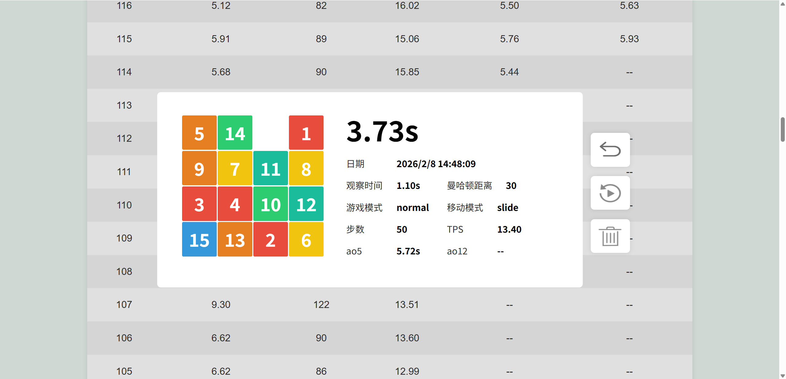

# 简介

此仓库是个人博客，但是没什么内容好写，就做了点小游戏：

- 🧩 数字华容道
- 🐍 贪吃蛇

# 访问地址

网页部署使用Github Pages和Netlify两种，二者内容相同，用户本地数据不互通；

Github Pages: https://criel14.github.io/

Netlify (国内直接访问) : https://criel-puzzle-game.netlify.app/

 

# Puzzle Game 数字华容道

## 简介

这是一个数字华容道游戏，一般称作"15Puzzle"（即4×4的华容道有15个块），但本项目包含了2×2到10×10一共9种难度；

比较有意思的有2点：如何判断打乱是否有解？如何配置颜色？详见：[数字华容道详细介绍](./docs/PUZZLE_GAME.md)

## 功能一览

- 🕹️ 操作模式：滑动 / 点击 / 键盘
- 🎮 游戏模式：正常模式 / 盲玩模式
- 🔃 刷新打乱
- 📏 阶数调整：2×2 ➡️ 10×10
- 🎨 个性化：自定义外观（文字大小 / 圆角 / 间距）、保存预设、更明显的鼠标指针、极简UI切换
- 📊 实时统计：游戏时间、移动步数、TPS
- 🧮 成绩统计：分组选择，分组最佳/平均（时间/步数/TPS）、平均观察时间、5/12 连复原平均、统计折线图、单次成绩
- 🎥 录像回放：倍速播放、录像重玩

## 页面展示

### 游戏页

### 成绩列表页

### 成绩详细页

 

# Snake Game 贪吃蛇

## 简介

贪吃蛇也是一个非常经典的游戏，参考了现代俄罗斯方块相对于经典俄罗斯方块的新机制，在本项目中引入了几个新的机制：

- ⏱️ **碰撞缓冲**：蛇头碰撞后进入容错计时，可转向避免失败
- 🚀 **锁定冲刺**：锁定方向后冲刺到底，吃苹果可额外得分

## 功能一览

- 🕹️ 开始 / 暂停 / 结束游戏
- ⏱️ 自定义蛇的移动时间间隔
- 🌐 中 / 英文显示切换
- 🎨 深色 / 浅色主题切换
- 🎮 游戏模式：🍎 40 苹果竞速、⏳ 限时打分、🆓 自由模式
- 🕹️ 游戏操作：转向 / 移动
- 📊 统计内容：游戏时间、分数、苹果数、平均每个苹果得分、当前模式的最佳记录

## 页面展示

### 浅色模式

### 深色模式

 

# 反馈

> tips：此项目纯娱乐，随缘更新

如有疑问或建议，请联系chencriel@qq.com

# 支持我

如果对你有帮助，我非常荣幸，玩得开心！你的支持是我进步的动力。

