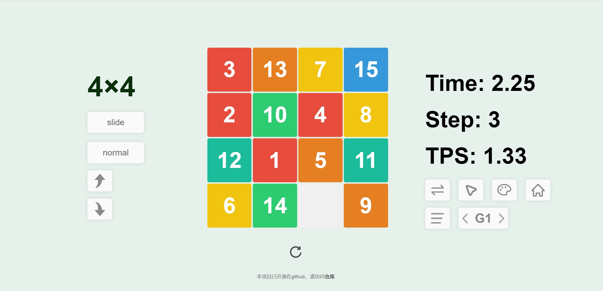
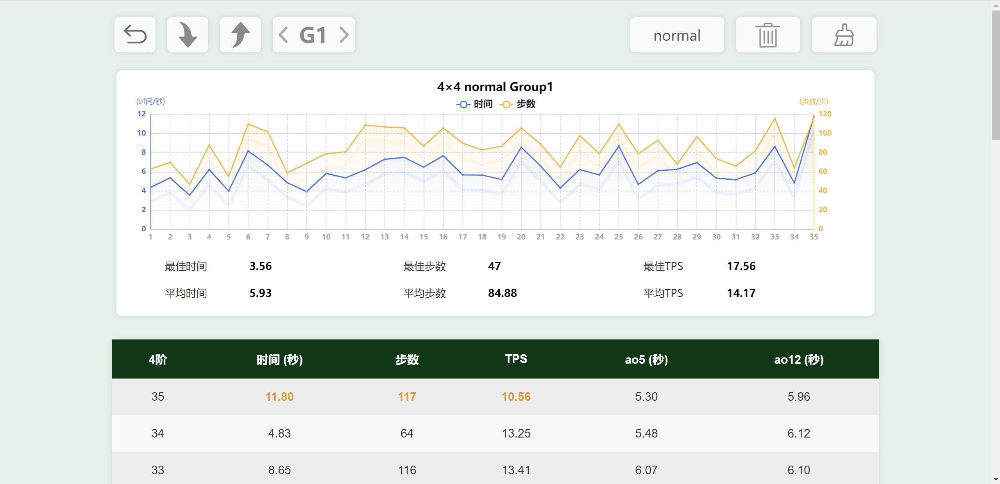
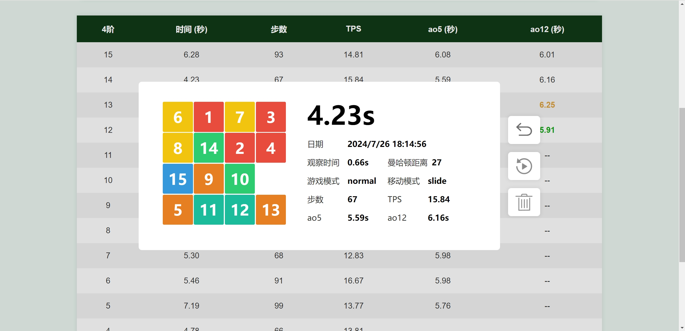
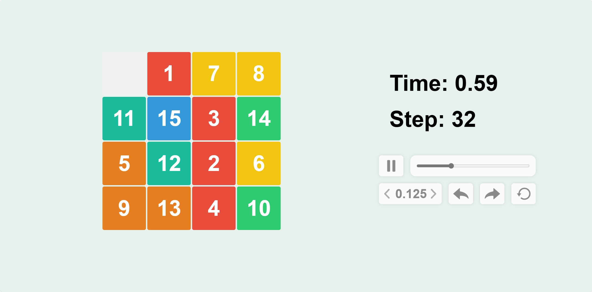

# 网页数字华容道 15 Puzzle Game


## 简介

这是一个静态web数字华容道游戏，虽然叫15Puzzle（4×4有15个块），但实际上包括2×2到10×10一共9种难度，具体功能见后文。

主要技术：前端基础三件套；使用的js库：ECharts图表, jscolor取色器

起初是想用Github Pages搭建一个个人博客的，后来想着普通的上传文章的博客不够有趣，就准备做一个js小游戏，正好我对数字华容道游戏颇有兴趣和研究，就往这个方向做了。一开始不够了解Pages或者说类似的服务，以为只能用模板或者普通的三件套来做，后面才知道像netify这样的平台实际上可以直接部署vue项目的，当然都是没有后端的，也就是无法使用数据库这些。但是当我知道这个的时候已经快要完成所有功能了，就不改了。

另外，暑假想找点事情做，虽然我不熟悉前端，但是前端是能够快速将想法变成实际界面的，刚好这学期学习了人机交互相关的知识，对这方面有点兴趣，就来做这个了。

最后，整个过程当然离不开AI的辅助，主要使用：GPT4o，Copilot，CodeGeeX


## 网页地址

Github Pages: https://criel14.github.io/

netlify: https://criel-puzzle-game.netlify.app/

tip: 二者内容相同，都能在国内访问；前者速度较慢，若没有科学上网，则部分页面需要加载很久；后者速度较快，但是限制流量，若访问人数较多则可能用尽。


## 主要页面展示

### 欢迎页


### 游戏页



### 游戏页—个性化设置


### 成绩列表页



### 成绩列表页—详细成绩



### 录像回放页




## 主要功能

- **游戏页**
  - **华容道还原：**系统自动生成打乱，玩家根据选定模式操作拼图快，系统统计数据，复原判定等
  - **改变阶数：**切换2×2到10×10共9种阶数
  - **改变游戏模式：**切换normal普通模式、blind盲玩模式
  - **改变移动/操作模式：**切换slide滑动、click点击、keyboard键盘
  - **刷新打乱：**
    - 正常模式：重新打乱；
    - 录像重玩模式：刷新原本打乱
  - **切换显示模式：**隐藏部分UI，沉浸式游玩
  - **切换光标样式：**切换是否使用网站自带的大尺寸光标，游玩过程中操作更清晰
  - **个性化设置：**
    - 调节方块不同阶层的颜色（按层降阶）、数字文本大小、方块间隙大小、圆角大小（文字颜色无给予调整，为白色）
    - 默认自带2个预设，分别为《扫雷联萌》中的 ”彩虹“ 主题和 ”彩虹微调“ 主题
  - **数据统计：**
    - 游玩页显示时间、步数、TPS三个当局数据，进入成绩列表页查看详细数据
    - 一共10个分组，可选择将当前成绩统计入特定的组
- **成绩列表页**
  - **小组总体统计：**
    - 小组成绩折线图：为时间和步数这两项数据绘制统计图
    - 统计小组的平均时间、最佳实践、平均步数、最佳步数、平均TPS、最佳TPS
  - **小组成绩列表：**
    - 显示所选分组的基本成绩列表，列表显示基本信息：时间、步数、TPS、5次平均、12次平均
    - 用颜色高亮表示出每项数据的最好和最快数据
    - 点击列表行进入该行的详细成绩页面
      - 显示所选行的详细成绩：日期、观察时间、曼哈顿距离、游戏模式、移动模式、步数、TPS、5次平均、12次平均
      - 选择观看本次成绩的录像回放
  - **数据选择：**可切换不同阶数、不同游戏模式、不同分组，来查看不同的成绩列表
  - **数据修改：**
    - 可选择删除本组成绩、删除所有成绩
    - 在详细成绩页可选择删除本次成绩
- **录像回放页**
  - **录像播放：**
    - 播放与暂停
    - 播放上一步与下一步
    - 选择播放倍数，最低0.125倍，最高10倍
  - **录像重玩：**
    - 进入游戏页的录像重玩模式，可使用不同的操作方式重试相同打乱，但游玩结果不计入成绩列表


## 技术细节

### 关于打乱

打乱有2个需要解决的点：

- **打乱无解**

  - 如果直接使数组元素随机排列，则有可能会产生无解情况。

  - 因此这里需要判断是否有解：

    ​		**数字华容道NxN数字随机排列的阵列（行号列号从0开始）有解的充要条件是：（总逆序数 + 0的行号 + 0的列号）与 N 不同奇偶**

  - 应该有更好的方法，但是我只知道这个 :）

- **打乱过于简单**

  - 如果全随机，虽然几率很小，但是可能遇到一步还原，或者打乱结果就是已经还原的情况
  - 这里通过计算**总曼哈顿距离**来判定，设定n×n数字华容道的总曼哈顿距离不小于n×n

```javascript
// 当打乱符合条件的时候再退出循环
while (true) {
    // 随机打乱
    tiles = Array.from({ length: size * size }, (_, i) => i);
    for (let i = tiles.length - 1; i > 0; i--) {
        const j = Math.floor(Math.random() * (i + 1));
        [tiles[i], tiles[j]] = [tiles[j], tiles[i]];
    }

    // 如果曼哈顿距离小于size * size就重新打乱
    manhattanDistance = calculateManhattanDistance(tiles, size);
    if (manhattanDistance < size * size) {
        continue;
    }
    // 计算0的行号和列号
    zeroIndex = tiles.indexOf(0);
    // 判断（总逆序数 + 0的行号 + 0的列号）与 N 是否不同奇偶 => 奇偶相加必为奇
    if ((countInversions(tiles) + Math.floor(zeroIndex / size) + zeroIndex % size + size) % 2 == 1) {
        break;
    }
}
```

说明:

- **tiles **是一个全局变量，保存当前拼图快序列；
- **size** 是一个全局变量，保存当前游玩的阶数；
- **manhattanDistance** 是一个全局变量，保存当局游戏的打乱的曼哈顿距离；
- **countInversions(tiles)** 用于计算总逆序数，使用归并排序的方法；
- **calculateManhattanDistance(tiles, size)** 用于计算总曼哈顿距离；
- 判断是否不同奇偶，可以用“奇偶相加必为奇”的原理；
- 要重新打乱的次数基本在1次到5次，这样子并不会消耗过多时间；应该有更好的方法，但是我只想道这个 :）
