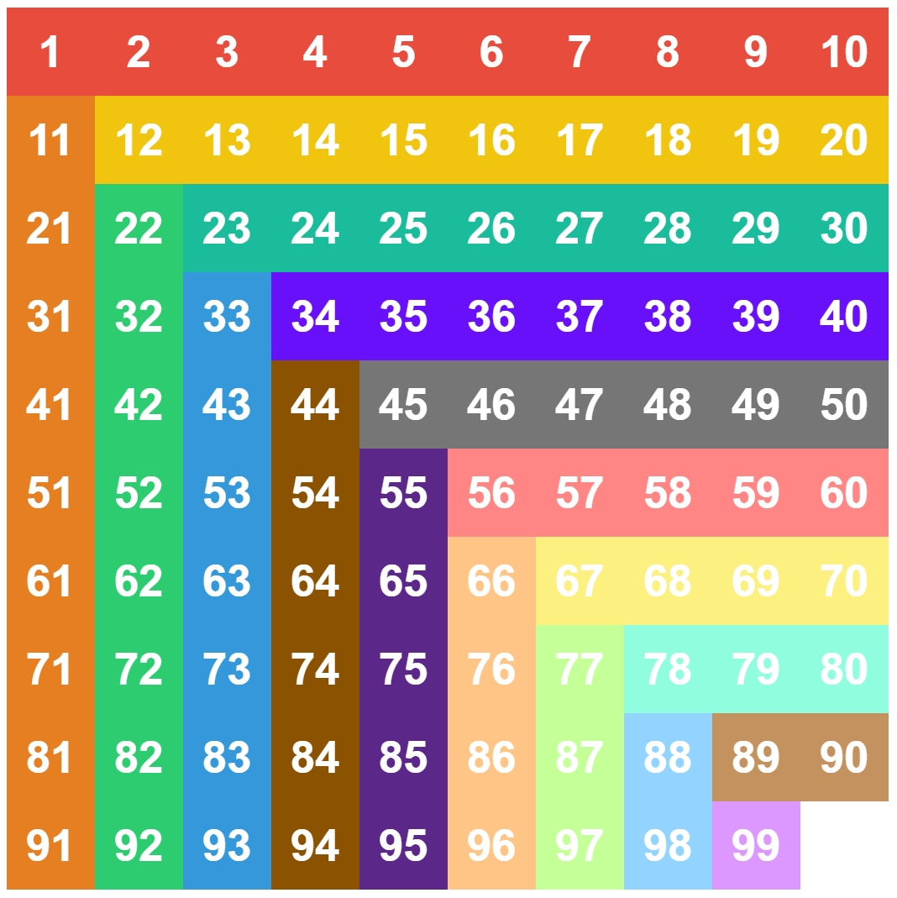

# 技术细节

## 关于打乱

打乱有2个需要解决的点：

- **打乱无解**

  - 如果直接使数组元素随机排列，则有可能会产生无解情况。
  - 因此这里需要判断是否有解：
    - **数字华容道NxN数字随机排列的阵列（行号列号从0开始）有解的充要条件是：（总逆序数 + 0的行号 + 0的列号）与 N 不同奇偶**
  - 应该有更好的方法，但是我只知道这个 :）

- **打乱过于简单**

  - 如果全随机，虽然几率很小，但是可能遇到一步还原，或者打乱结果就是已经还原的情况
  - 这里通过计算**总曼哈顿距离**来判定，约定n×n数字华容道的总曼哈顿距离不小于n×n

```javascript
// 当打乱符合条件的时候再退出循环
while (true) {
    // 随机打乱
    tiles = Array.from({ length: size * size }, (_, i) => i);
    for (let i = tiles.length - 1; i > 0; i--) {
        const j = Math.floor(Math.random() * (i + 1));
        [tiles[i], tiles[j]] = [tiles[j], tiles[i]];
    }

    // 如果曼哈顿距离小于size * size就重新打乱
    manhattanDistance = calculateManhattanDistance(tiles, size);
    if (manhattanDistance < size * size) {
        continue;
    }
    
    // 计算0的行号和列号
    zeroIndex = tiles.indexOf(0);
    // 判断（总逆序数 + 0的行号 + 0的列号）与 N 是否不同奇偶 => 奇偶相加必为奇
    if ((countInversions(tiles) + Math.floor(zeroIndex / size) + zeroIndex % size + size) % 2 == 1) {
        break;
    }
}
```

说明:

- **tiles** 是一个全局变量，保存当前拼图快序列；
- **size** 是一个全局变量，保存当前游玩的阶数；
- **manhattanDistance** 是一个全局变量，保存当局游戏的打乱的曼哈顿距离；
- **countInversions(tiles)** 用于计算总逆序数，使用归并排序的方法；
- **calculateManhattanDistance(tiles, size)** 用于计算总曼哈顿距离；
- 判断是否不同奇偶，可以用“奇偶相加必为奇”的原理；
- 要重新打乱的次数基本在1次到5次，这样子并不会消耗过多时间；应该有更好的方法，但是我只想到这个 :）

<br>

## 关于颜色主题

为了方便，本网页只提供了最常用的 **按层降阶** 的方式配色的主题，也就是如下图所示，一种颜色就是一个区域，一共18个区域 + 数字0（空白格）共 **19种颜色**。



代码中定义了一个颜色配置字典，格式如下：

```javascript
let colorConfig = {
    0: "#f0f0f0",
    1: "#fde5ff",
	...
    // 从0到18
};
```

通过每个块的序号 ，计算出其坐标，从而得到其层数

```javascript
// 返回层数，一行一列这样，在颜色里使用
function getLayer(number, size) {
    number--;
    // 获取行列号（从0开始）
    row = Math.floor(number / size);
    line = number % size;
    // 以左上到右下的对角线分为上三角和下三角
    // 上三角或对角线
    if (line >= row) {
        return 2 * row + 1;
    }
    // 下三角
    else {
        return (line + 1) * 2;
    }
}
```

再通过层数从颜色字典里获取颜色，在绘制的时候设置style即可

```javascript
// 根据数字返回对应的颜色，默认为#ffffff
// number为0至size*size -1，0为空白格，number和显示出来的数字是一样的
function getColor(number, size) {
    return colorConfig[getLayer(number, size)] || "#ffffff";
}
```

<br>

## 关于数据存储

由于本网页没有后端的数据库，所有数据都存储在浏览器的Local Storage中；

```javascript
// 从localStorage中获取数据
let config = JSON.parse(localStorage.getItem('config')) || [];

// 将数据保存到localStorage
localStorage.setItem("config", JSON.stringify(config));
```

一共存储了4项数据，具体内容如下：

- **config**  配置信息

  - **gameMode**  当前游戏模式

  - **groupNumber**  当前选择组号

  - **isCustomCursor**  是否启用自定义鼠标指针

  - **moveMode**  当前移动模式

  - **size**  当前游玩阶数

  - **styleConfig**  个性化设置

  - - **borderRadiusRatio**  圆角半径比例（圆角半径 = 拼图快边长 * 圆角半径比例）
    - **colorConfig**  颜色配置，同“颜色主题”部分中的颜色配置
    - **fontSizeRatio**  字体大小比例（字体大小 = 拼图快边长 * 字体大小比例）
    - **gapWidthRatio** 拼图快间隙比例（拼图快间隙 = 拼图快边长 * 拼图快间隙比例）

- **scores** 所有成绩的总列表，每一项为**score**，存储每一把的详细成绩信息，**score**中的内容如下：

  - **size**  阶数
  - **gameMode**  游戏模式
  - **group**  所属组号
  - **number** 在所属组中的序号
  - **step**  步数
  - **time**  完成时间
  - **tps**  每秒移动次数
  - **ao5**  当前成绩与前4把成绩的5次去尾平均
  - **ao12**  当前成绩与前11把成绩的12次去尾平均
  - **dateTime**  完成时的系统时间
  - **manhattanDistance**  曼哈顿距离
  - **moveMode**  移动/操作模式
  - **observeTime**  观察时间
  - **scramble**  存储打乱序列的数组
  - **moveSequence**  移动序列，在录像回放功能中使用，每一项包含2个属性：
    - direction：本次移动的方向，有4中情况：'R', 'L', 'U', 'D'
    - time：本次移动的时间节点

- **currentScore**  当前正在被查看详细成绩的成绩信息，用于同步至录像回放页，保存的数据项同scores中的score

- **currentScoreList**  从scores中根据size, gameMode, group这三个属性筛选出子的成绩列表，用于生成图表、统计本组总体成绩

<br>

<span id="log"></span>

# 日志

- ——项目基础搭建——
- 2024.7.16
  - 正式开始制作，初步实现游戏基本操作
- 2024.7.17
  - 规划完善主界面UI布局
- 2024.7.18
  - 初步实现成绩列表功能
- 2024.7.19
  - 添加更多游戏模式、移动/操作模式
- 2024.7.20
  - 添加自定义光标功能
- 2024.7.21-22
  - 实现用户对数据的基本管理
- 2024.7.23
  - 初步实现成绩列表页的统计图表功能
- 2024.7.24
  - 初步实现个性化调节功能
- 2024.7.25
  - 完善个性化调节功能
  - 初步实现录像回放功能
- 2024.7.26
  - 完善录像回放功能，修复优化项目的各个部分
  - 项目初发布，版本20240726
- ——以下是后续优化——
- 2024.7.27
  - 适配移动端的滑动操作和UI， **需要横屏**
  - 成绩列表页新增最佳ao5，最佳ao12，平均观察时间
  - 当某一分组的游戏局数小于等于1时，将不显示折线图
  - 更改计算ao5和ao12的规则：
    - 当列表最后的5把或12把，每一把的游玩间隔不超过5分钟，才会计入平均
  - **注意！！** 若你在7月27日21:00前游玩过游戏，由于对游玩数据的构成做了修改，当你遇到问题时，请清除你的浏览器缓存！如有能力，则请直接删除localStorage中的scores列表即可。
- 2024.7.29
  - 滑动模式下，按住 **ctrl** 能够暂时屏蔽鼠标滑动操作
    - 由于滑动使用“mouseover”判断，例如按住ctrl，鼠标悬停在5上（假设5和0相邻），松开ctrl，并不会使5发生移动，需要从其他滑块进入5才会发生移动

  - 为以下数据修改操作添加**确认操作**提示
    - 修改颜色配置未保存直接返回
    - 删除某次成绩
    - 删除某一组成绩
    - 删除全部成绩
- 2024.8.2
  - 个性化设置界面大改，分成三个界面
    - 颜色：修改每一层的方块颜色和字体颜色（新增字体颜色的修改）
    - 大小：修改方块间隙大小、字体大小、圆角大小
    - 预设/方案：
      - 提供2个系统自带预设
      - 提供3个自定义方案栏（新增自定义方案，config新增customConfig1，customConfig2，customConfig3子对象）

  - 部分功能增加了NoticeJs弹框提示

